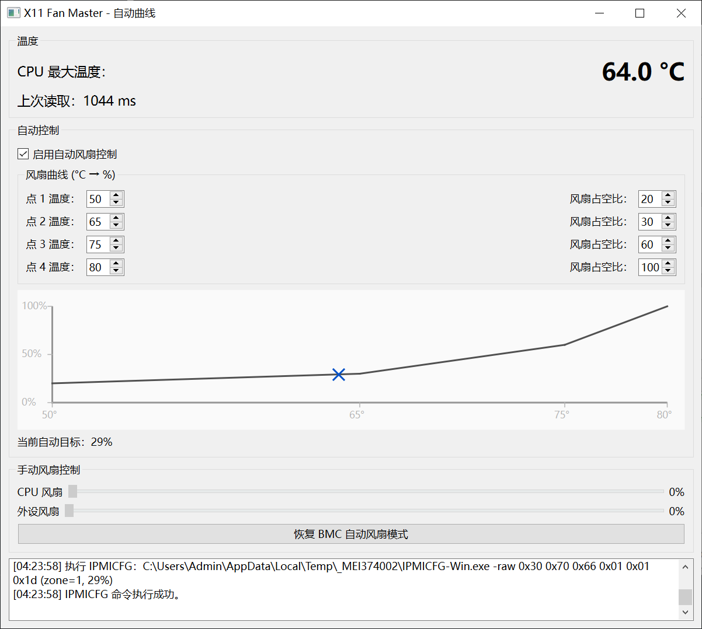

# X11 Fan Master

> Windows fan controller for Supermicro X11 boards, with auto fan curve based on CPU temperature.  
> 基于 CPU 温度曲线的 Supermicro X11 系列主板风扇控制工具（Windows）。

---

## Overview / 项目简介

**English**

X11 Fan Master is a small Windows utility for Supermicro X11 series motherboards.  
It reads CPU temperature via **LibreHardwareMonitor** and controls BMC fan speed via Supermicro **IPMICFG**, providing:

- Manual control of CPU & peripheral fan duty (raw IPMI commands)
- Custom automatic fan curve (°C → %, 4 points with interpolation)
- Live temperature display with over-temperature highlight
- Simple log view of all executed IPMICFG commands

The app is designed to be portable: a single EXE that bundles IPMICFG and LibreHardwareMonitor, so it can run on a clean system with only BMC/IPMI available.

---

**中文说明**

X11 Fan Master 是一个用于 **Supermicro X11 系列主板** 的 Windows 小工具。  
它通过 **LibreHardwareMonitor** 读取 CPU 温度，并使用 Supermicro 官方的 **IPMICFG** 工具向 BMC 发送风扇控制指令，实现：

- CPU 风扇 / 外设风扇转速的手动调节（底层 IPMI RAW 命令）
- 可自定义的自动风扇曲线（温度 → 转速，4 个控制点，线性插值）
- 实时显示 CPU 最大核心温度，超过阈值自动高亮
- 底部日志窗口，记录所有执行过的 IPMICFG 命令和返回信息

程序打包为**单一 EXE**，内置 IPMICFG 与 LibreHardwareMonitor，可以在“只装了系统和 BMC”的环境中直接运行。

---

## Features / 功能特点

- 🎛 **Manual fan control / 手动风扇控制**
  - 独立调节 CPU 风扇和外设风扇占空比（0–100%）
  - 使用 IPMICFG `-raw 0x30 0x70 0x66 0x01 ...` 直接下发 PWM 值
- 📈 **Auto fan curve / 自动风扇曲线**
  - 4 个可配置控制点（温度 °C → 风扇百分比 %）
  - 在点与点之间做线性插值，得到平滑风扇曲线
  - 勾选“启用自动风扇控制”后，软件会按曲线自动调整 PWM
- 🌡 **Temperature monitor / 温度监控**
  - 使用 LibreHardwareMonitor WMI (`root\LibreHardwareMonitor`) 读取所有 CPU core 温度
  - “CPU 最大温度”显示为所有核心中的最大值（若无 core 传感器则回退 CPU Package）
  - 温度 ≥ 80°C 时数字变为红色
  - 显示每次温度读取耗时（ms），便于观察采样性能
- 🧮 **Curve visualization / 曲线可视化**
  - 中部简易曲线图：X 轴为温度，Y 轴为风扇占空比
  - 黑色折线表示当前配置的风扇曲线
  - 蓝色 `X` 标记当前 CPU 温度与实际生效的风扇占空比
- 📜 **Log window / 日志窗口**
  - 记录：
    - IPMICFG 的调用参数
    - 标准输出 / 标准错误
    - 退出码
  - 便于调试 BMC 行为或分析异常
- ♻ **BMC auto mode / BMC 自动模式**
  - 一键恢复 BMC 默认风扇策略（发送 `-raw 0x30 0x45 0x01 0x01`）
  - 重置后滑条归零，不再强制 PWM
Requirements / 环境要求

English

Windows 10 / 11 (64-bit)

Supermicro X11 series motherboard with BMC/IPMI

Supermicro IPMICFG for Windows (IPMICFG-Win.exe, tested with v1.33.0)

Administrator privileges (required for IPMI & WMI access)

中文

Windows 10 / 11 64 位

带 BMC / IPMI 的 Supermicro X11 系列主板

Supermicro 官方 IPMICFG 工具（IPMICFG-Win.exe，测试版为 1.33.0）

管理员权限运行（访问 IPMI 和 WMI 需要）

⚠ 安全提示 / Disclaimer
本工具会覆盖 BMC 自带的风扇策略。请确保曲线设置合理，并密切监控 CPU/GPU 温度。
由于使用的是 OEM IPMI 命令，本项目与 Supermicro 官方无关，风险自负。

Related & referenced projects / 相关引用项目

本项目在设计与实现过程中参考/使用了以下开源项目与工具：

KCORES / fan-lord

提供了基于 IPMICFG 的 Python 图形界面风扇控制示例。本项目最初的手动风扇控制逻辑、IPMI RAW 命令调用方式等均参考了该项目，并在此基础上增加自动温控曲线与 LibreHardwareMonitor 集成。

LibreHardwareMonitor / LibreHardwareMonitor

用于硬件传感器读数和 WMI 接口，项目中直接随 exe 一起打包运行。

Supermicro IPMICFG
官方 IPMI 配置工具，用于通过 -raw 命令控制风扇 PWM、重置 BMC 风扇模式等。

如果你觉得本项目对你有帮助，也推荐顺手给上述上游项目点一颗 ⭐ 以示支持。

